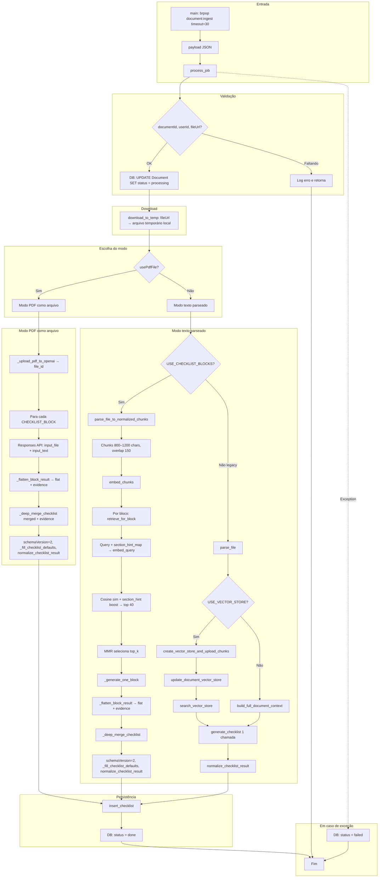

# Fluxo do Worker de Ingestão de Documentos

O worker consome a fila Redis `document:ingest`, baixa o arquivo (URL pré-assinada), extrai texto (unstructured) ou envia o PDF como arquivo, gera checklist via LLM (por blocos com evidência ou PDF via Responses API) e atualiza o status do documento no Postgres.

---

## Visão geral

```
Redis (document:ingest) → process_job → Download → [PDF como arquivo | Parse texto] → Checklist (LLM por blocos ou legacy) → Normalização → Postgres (Document + Checklist)
```

---

## Diagrama do fluxo principal



---

## 1. Entrada e payload

### main()

- Conecta ao Redis, loop com `brpop(QUEUE_NAME, timeout=30)`.
- Ao receber mensagem: `json.loads(raw)` → `process_job(payload)`.

### Payload do job

| Campo        | Obrigatório | Descrição                                      |
|-------------|-------------|------------------------------------------------|
| `documentId`| Sim         | ID do documento no Postgres                    |
| `userId`    | Sim         | ID do usuário                                  |
| `fileUrl`   | Sim         | URL pré-assinada para download                 |
| `fileName`  | Não         | Nome do arquivo (default: "document")          |
| `usePdfFile`| Não         | Se true, envia PDF como arquivo (Responses API com visão) |

---

## 2. process_job: sequência geral

1. Validar `documentId`, `userId`, `fileUrl`; se faltar algo, log e return.
2. **DB**: `UPDATE Document SET status = 'processing'`.
3. **Download**: `download_to_temp(file_url, file_name)` → path temporário.
4. Criar `OpenAI(api_key=OPENAI_API_KEY)`.
5. Escolher modo e gerar checklist (ver seções 3 e 4).
6. **DB**: `insert_checklist` (e opcionalmente upload de debug JSON no MinIO).
7. **DB**: `UPDATE Document SET status = 'done'`.
8. Em exceção: `status = 'failed'`.
9. **finally**: remover arquivo temporário.

---

## 3. Modo PDF como arquivo (`usePdfFile = true`)

1. **Upload**: `_upload_pdf_to_openai(pdf_path, file_name)` → `file_id` (Files API, purpose=user_data).
2. Para cada um dos 8 blocos em `CHECKLIST_BLOCKS`:
   - Opcional: `time.sleep(PDF_BLOCK_DELAY_SEC)` entre blocos.
   - `_generate_one_block_from_pdf_file`: Responses API com `input_file` (file_id) + `input_text` (instrução do bloco), `response_format` = json_schema do bloco.
   - `_flatten_block_result(block_key, block_data)` → `(flat, evidence)`.
   - Se houver `evidence`, fazer merge em `merged["evidence"]`.
   - `_deep_merge_checklist(merged, flat)`.
3. `merged.setdefault("schemaVersion", 2)`.
4. `_fill_checklist_defaults(merged)`.
5. `normalize_checklist_result(merged)`.

---

## 4. Modo texto parseado (`usePdfFile = false`)

### 4.1 Com blocos + retrieval (`USE_CHECKLIST_BLOCKS = true`, padrão)

1. **Parse**: `parse_file_to_normalized_chunks(file_path, file_name)`.
   - `partition(filename=..., languages=["por"])` (unstructured).
   - Segmentos viram chunks de **800–1200 caracteres** (`CHUNK_MIN_CHARS`, `CHUNK_MAX_CHARS`) com **overlap de 150** (`CHUNK_OVERLAP_CHARS`) para não cortar cláusulas.
   - Cada chunk: `text`, `page_number`, `section_hint`, `chunk_id`.
   - `section_hint` via `_detect_section_hint` e `HEADING_PATTERNS` (ex.: DOCUMENTAÇÃO, PRAZOS, SESSÃO).

2. **Embeddings**: `embed_chunks(openai_client, normalized_chunks)`.
   - Texto de cada chunk → `text-embedding-3-large`.
   - Batches de até 2048 inputs.

3. **Por bloco** (8 blocos) em `CHECKLIST_BLOCKS`:
   - **Retrieval**: `retrieve_for_block(openai_client, query, chunks_with_embeddings, block_key=name, top_k=TOP_K_RETRIEVAL)`.
     - Query expandida com `section_hint_map[block_key]` (ex.: blocos "documentos" → "DOCUMENTAÇÃO HABILITAÇÃO QUALIFICAÇÃO").
     - `embed_query(search_query)`.
     - Para cada chunk: cosine similarity com a query; opcional **section_hint boost** (×1.15) quando o hint do chunk combina com o bloco (documentos, prazos, sessao_disputa).
     - Ordenar por score e pegar **top 40** (`TOP_N_FOR_MMR`).
     - **MMR** (Maximal Marginal Relevance): entre os 40, selecionar `top_k` (12) maximizando `λ·sim(q,d) - (1-λ)·max_sim(d, já_selecionados)` com `MMR_LAMBDA=0.7` para equilibrar relevância e diversidade.
     - Contexto = concatenação dos textos dos chunks selecionados.
   - **LLM**: `_generate_one_block(openai_client, block, context, file_name)` → Chat Completions com system + user (trechos), response_format = json_schema do bloco.
   - `_flatten_block_result(name, block_data)` → `(flat, evidence)`.
   - Merge de `evidence` em `merged["evidence"]` e de `flat` em `merged` com `_deep_merge_checklist`.
4. `schemaVersion = 2`, `_fill_checklist_defaults`, `normalize_checklist_result`.

### 4.2 Legacy (sem blocos, `USE_CHECKLIST_BLOCKS = false`)

1. **Parse**: `parse_file` → lista de textos (chunks do partition).
2. **Contexto**:
   - Se `USE_VECTOR_STORE`: `create_vector_store_and_upload_chunks` → **DB**: `update_document_vector_store(document_id, vector_store_id)` → `search_vector_store(CHECKLIST_QUERY)` e juntar textos.
   - Senão: `build_full_document_context(chunks_text)` (concatenação).
3. **Uma chamada**: `generate_checklist(openai_client, context, file_name)` com schema completo (v1-compat).
4. `normalize_checklist_result`.

---

## 5. Blocos do checklist (CHECKLIST_BLOCKS)

Os blocos usam schemas com **Field** / **BoolField** / **Evidence** (schema v2): `valor` + `evidencia` (trecho, ref, page). O merge usa a forma “flat” após `_flatten_block_result`.

| key                    | Conteúdo principal |
|------------------------|---------------------|
| `edital`               | Identificação: licitacao, edital, orgao, objeto, dataSessao, portal, numeroProcessoInterno, totalReais, valorEnergia, volumeEnergia, vigenciaContrato, modalidadeConcessionaria, prazoInicioInjecao (cada um como Field). |
| `modalidade_participacao` | modalidadeLicitacao (Field), participacao.permiteConsorcio/beneficiosMPE (BoolField), itemEdital (Field). |
| `prazos`               | enviarPropostaAte, esclarecimentosAte, impugnacaoAte (data, horario, raw, evidencia), contatoEsclarecimentoImpugnacao (Field). |
| `documentos`           | **requisitos[]**: categoria, referencia, local, descricao, obrigatorio, etapa, condicao, evidencia. Convertido para `documentos` (categoria/itens) por `_requisitos_to_documentos` para compatibilidade com o front. |
| `visita_proposta`      | visitaTecnica (BoolField), proposta.validadeProposta (Field). |
| `sessao_disputa`       | sessao: diferencaEntreLances, horasPropostaAjustada, abertoFechado, criterioJulgamento, tempoDisputa, tempoRandomico, faseLances, prazoPosLance. |
| `pagamento_contrato`   | outrosEdital.mecanismoPagamento. |
| `analise`              | responsavelAnalise, pontuacao (0–100), recomendacao. |

---

## 6. Flatten e merge

- **`_flatten_block_result(block_key, block_data)`**: converte saída do LLM (Field/BoolField/Evidence) em dicionário “flat” para merge e em dicionário de evidências.
  - Para `documentos`: se o bloco retornar `requisitos`, preenche `flat["requisitos"]` e `flat["documentos"] = _requisitos_to_documentos(requisitos)`.
- **`_deep_merge_checklist(base, block_result)`**: merge in-place; listas são substituídas; dicts são merged recursivamente (exceto chave `evidence`, que é tratada separadamente).
- Evidências são mergadas em `merged["evidence"]` (por bloco/seção).

---

## 7. Normalização e defaults

- **`_fill_checklist_defaults(merged)`**: garante todas as chaves obrigatórias do `CHECKLIST_JSON_SCHEMA` (edital, documentos, participacao, proposta, sessao, outrosEdital, requisitos, etc.) com valores padrão.
- **`normalize_checklist_result(data)`**:
  - Datas (edital.dataSessao, prazos.*.data) → DD/MM/AAAA.
  - Moeda: só adiciona "R$" quando o texto parece valor monetário (ex.: 1.234,56).
  - Booleanos (participacao, visitaTecnica) com default e tipo correto.
  - Deduplicação de itens em `documentos` por (documento, referencia).

---

## 8. Persistência e debug

- **`insert_checklist(conn, user_id, file_name, data, document_id)`**: INSERT em `Checklist` (id, userId, file_name, data JSON, pontuacao, orgao, objeto, valor_total, documentId). Orgao/objeto/valor_total vêm de `data.edital`.
- **Debug (MinIO)**: `upload_debug_json(user_id, document_id, unstructured_debug, "unstructured-debug")` e `upload_debug_json(..., openai_debug, "openai-debug")` quando MinIO está configurado.

---

## 9. Variáveis de ambiente relevantes

| Variável               | Uso principal |
|------------------------|---------------|
| `REDIS_URL`            | Fila `document:ingest` |
| `DATABASE_URL`         | Postgres (Document, Checklist) |
| `OPENAI_API_KEY`       | Chat, Responses, Embeddings, Files |
| `OPENAI_CHAT_MODEL`    | Modelo (default: gpt-4o) |
| `USE_PDF_AS_FILE`      | Default do modo PDF como arquivo |
| `USE_CHECKLIST_BLOCKS` | Ativa blocos + retrieval (default: true) |
| `USE_VECTOR_STORE`     | Legacy: vector store no fluxo sem blocos |
| `PDF_BLOCK_DELAY_SEC`  | Atraso entre blocos no modo PDF (ex.: 2.0) |
| `CHUNK_MIN_CHARS` / `CHUNK_MAX_CHARS` | Tamanho dos chunks (800–1200) |
| `CHUNK_OVERLAP_CHARS`  | Overlap entre chunks (150) |
| `TOP_K_RETRIEVAL`      | Chunks por bloco no retrieval (12) |
| `TOP_N_FOR_MMR`        | Candidatos antes do MMR (40) |
| `MMR_LAMBDA`           | Peso relevância no MMR (0.7) |
| MinIO (opcional)       | Upload de JSONs de debug |

---

## 10. Resumo dos três caminhos

1. **PDF como arquivo**: Download → Upload PDF (Files API) → 8 chamadas Responses API (uma por bloco em `CHECKLIST_BLOCKS`) → flatten + merge + evidence → schemaVersion 2, defaults, normalize → insert_checklist → done.
2. **Blocos + retrieval**: Download → Partition → Chunks normalizados (800–1200 + overlap) → Embeddings → Por bloco: retrieval (query + section_hint_map, cosine + boost, MMR top_k) → 8 chamadas Chat (uma por bloco) → flatten + merge + evidence → schemaVersion 2, defaults, normalize → insert_checklist → done.
3. **Legacy**: Download → Partition → (opcional: vector store + update_document_vector_store + search) ou contexto completo → 1 chamada Chat (schema único) → normalize → insert_checklist → done.
